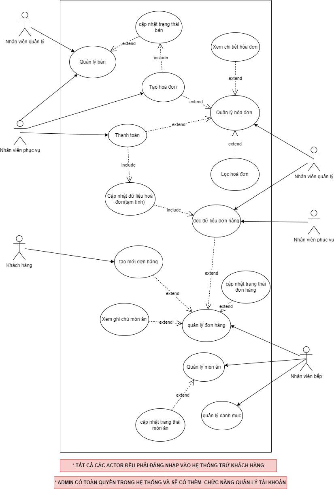
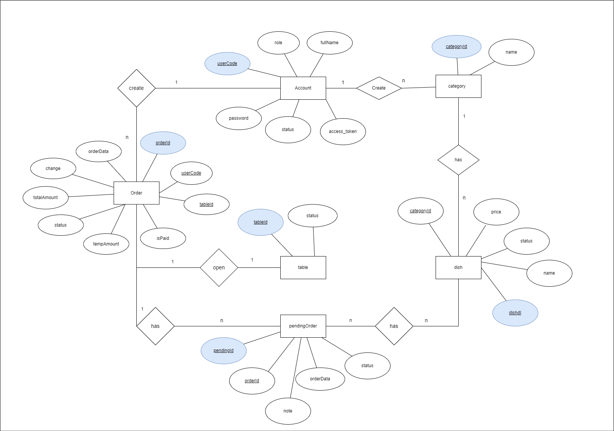

# SERVICE ORIENTED ARCHITECTURE

Đồ án môn học: **Kiến trúc hướng dịch vụ**
Giảng viên hướng dẫn: [**Dương Hữu Phúc**][dhp]

Thành viên tham gia:

-   Phạm Nguyễn Hoàng Quân - 51900419
-   Nguyễn Minh Phước - 51900770

## Giới thiệu đề tài

-   Tên đề tài: **TÌM HIỂU VÀ PHÂN TÍCH PHÂN HỆ QUẢN LÝ ĐƠN HÀNG TỪ THỰC KHÁCH**
    Nhằm tin học hoá quá trình giao tiếp giữa nhân viên phục vụ của nhà hàng và thực khách,
    nhà hàng đã yêu cầu xây dựng 1 phân hệ quản lý đơn hàng của thực khách . Ví dụ như hình dưới đây. Phân hệ cho phép (1) thực khách/khách hàng , (2)Nhân viên phục vụ, (3)Nhân viên bếp có thể tương tác với nhau theo thời gian thực, tăng cường trải nghiệm dùng bữa và giảm thiểu sai sót . Thực khách có thể chủ động trong việc gọi món ăn kiểm soát các món ăn đã gọi, cũng như tổng tiền của hoá đơn. Với nhân viên phục vụ, thay vì phải thực hiện các thao tác thủ công chắng hạn, ghi đơn hàng vào phiếu gọi món và chuyển phiếu đến co nhân viên bếp để chuẩn bị món ăn, thì việc triển khai phân hệ này cho phép giảm thiểu các thao tác thủ công như trước đây và đảm bảo tính chính xác. Bên cạnh đó, phân hệ cho phép nhân viên bếp kiểm soát các món ăn được gọi từ thực khách, đặc biệt là đảm bảo tính chính xác cho các ghi chú từ thực khách, điều mà trước đây thường xuyên xảy ra sai sót.

## Những tính năng chính

-   Đăng nhập/Đăng xuất
-   Quản lý nhân viên
-   Quản lý hóa đơn
-   Quản lý đơn hàng
-   Quản lý menu
-   Thanh toán
-   Báo cáo và thống kê

## 🔗Link demo

<a  margin=5 href="https://restaurant-management-fe.vercel.app/" target="blank">
    
</a>

## 📷Screenshot

### Dashboard

<div align="center" style="margin-bottom: 4rem">
    
</div>

### 🔥Login

<div align="center" style="margin-bottom: 4rem">
    
</div>

### Client

<div align="center" style="margin-bottom: 4rem">
    
</div>

### Use case diagram

<div align="center" style="margin-bottom: 4rem">
    
</div>

### ERD diagram

<div align="center" style="margin-bottom: 4rem">
    
</div>

## Công nghê sử dụng

Công nghệ sử dụng cho việc xây dụng hệ thống API BACK-END:

-   [Node.js] - evented I/O for the backend
-   [Express] - fast node.js network app framework
-   [SocketIO] - Bidirectional and low-latency communication for every platform
-   [Docker] - Bidirectional and low-latency communication for every platform

Công nghệ sử dụng xây dựng giao diện người dùng:

-   [VueJS] - HTML enhanced for web apps!

Hệ cơ sở dũ liệu : [MongoDB]

## Cài đặt

Yêu cầu tối thiểu [Node.js](https://nodejs.org/) v10+

Tiến hành cài đặt các gói thư viện cần thiết cho Back-end:

```sh
cd backend
npm install --force
```

Tiến hành cài đặt các gói thư viện cần thiết cho Front-end:

```sh
cd frontend
npm install
```

Cấu hình các biến môi trường cho Front-end:

-   **SERVER_BASE_URL**: địa chỉ mặc định của server.
-   **VUE_APP_BASE_URL**: địa chỉ mặc định của VueJS font-end chạy ở môi trường DEV.
-   **VUE_APP_API_URL**: chỉ định địa chỉ API cho việc call API ở phía font-end.

Cấu hình các biến môi trường cho Back-end:

-   **PORT**: port của server.
-   **HOST**: host của server mặc định là localhost.
-   **PORT_CLIENT**: port front end.
-   **DB_URL**: địa chỉ url của mongodb docker (ex: mongodb://mongo_container:27017/SOA_Midterm).
-   **ADMIN_PASSWORD**: 123456.
-   **ACCESS_TOKEN_SECRET_KEY**: .
-   **REFRESH_TOKEN_SECRET_KEY**: .

Cài đặt MongoDB, xem thêm cách cài đặt tại đây [MongoDB - Document]

## Khởi chạy hệ thống

Dưới đây là các bước chi tiết khởi chạy hệ thông sau khi hoàn thành các yêu cầu tối thiểu phía trên.

##### 1. Chạy ứng dụng :

APi sẽ được khởi chạy mặc định tại [localhost:3300](http://localhost:3300/)
Để xem document của api [localhost:3300/api/docs](http://localhost:3300/api/docs)

-   Khởi chạy api:

```
cd backend
npm run dev
```

Ứng dụng Vue sẽ được khởi chạy mặc định tại [localhost:8080](http://localhost:8080)

-   Khởi chạy Vue app:

```
cd frontend
npm run serve
```

##### 2. Build ứng dụng Vue:

Để build ứng dụng VUE bằng cách chạy dòng lệnh sau:

```
cd frontend
npm run build
```

Sau khi hoàn tất quá trình build ứng dụng, các tài nguyên được tạo trong thư mục **/frontend/dist**

##### 3. Deploy với docker:

```
docker-compose up
```

## License

MIT

**Thanks!**

[//]: # "These are reference links used in the body of this note and get stripped out when the markdown processor does its job. There is no need to format nicely because it shouldn't be seen. Thanks SO - http://stackoverflow.com/questions/4823468/store-comments-in-markdown-syntax"
[dhp]: https://github.com/duonghuuphuc
[git]: https://git-scm.com/
[node.js]: http://nodejs.org
[express]: http://expressjs.com
[vuejs]: http://vuejs.org
[mongodb]: https://www.mongodb.com
[mongodb - document]: https://www.mongodb.com/docs/
[SocketIO]: https://socket.io/
[Docker]: https://www.docker.com/
